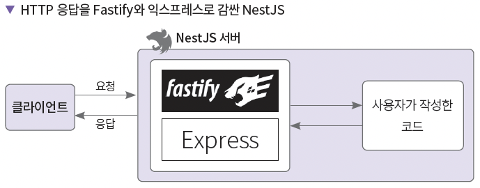
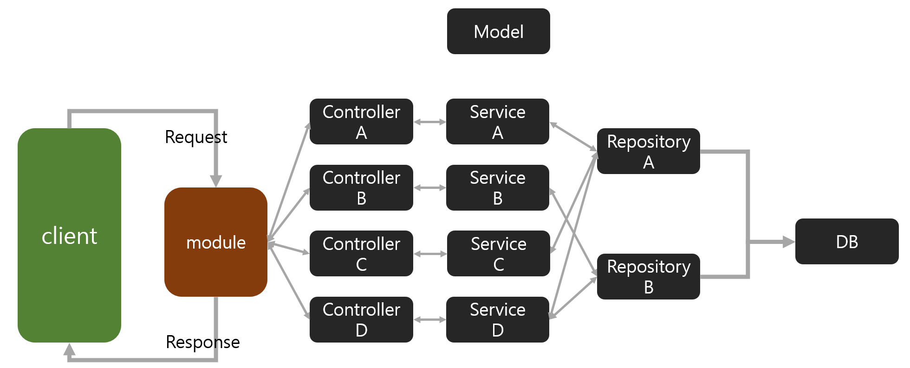

[Home](..)

# 프로젝트
Node.js 백엔드 개발자 되기 연습 프로젝트

## 개요
- 기간 : 2024. 04. 16 ~ 2024.06.03
  
- 기술 스택 : HTML, CSS, JavaScript, Node.js, express, NestJS, TypeScript, mongoDB, Sqlite
  
- 목적 : JS 및 TS를 활용한 백엔드 서버 개발 공부
<!-- - 요약 :  -->
- 책 : [Node.js 백엔드 개발자 되기(박승규)](https://product.kyobobook.co.kr/detail/S000201457949) 
<!-- - 링크 :  -->
<!-- - 결과 : [숫자 야구 게임 실습](./business/baseball/)
 -->

### 내용
    chapter~ : 제공받은 코드, practice~ : 직접 실습한 코드(2: node, 3~ : express, 8~ : NestJS)    
    노드 실행 Ctrl + F5 / 디버그 F5
    자주 사용하는 HTTP 헤더 Content-Type, Accept, Accept-Charset, User-Agent, Referer
    npx를 이용하면 node_modules 파일을 쉽게 실행 가능    
    NoSQL 종류 : 키-벨류, 컬럼, Document, Graph      
    몽고디비, mongoose  
    패스티파이 : 익스프레스와 하피에 영감을 받은 웹 프레임워크
    의존성 주입하기
    제어의 역전 원칙 을 사용 : 개발자가 객체를 생성하지 않고 프레임워크가 생성한 컨테이너가 의존성을 관리
    인증(Authentication)은 누구인지 확인하는 절차, 쿠키, 토큰, 세션
    인가(Authorization)는 인증된 사용자의 권한을 확인하는 절차
    구글 OAuth2
    
#### npm, yarn
    npm (node package manager) : 자바스크립트용 패키지 매니저, 프로젝트에 필요한 의존선 패키지를 관리, 의존성 패키지는 해당 프로젝트를 실행하는 데 꼭 필요한 라이브러리와 모듈
    패키지 : package.json 파일 등, 모듈 : node_modules
    NPX (Node Package eXecute) : 패키지를 임포트하지않고 모듈을 명령형으로 바로 실행
    package-lock.json : 특정 버전이 아닌 패키지를 설치하는 경우 현재 설치되는 패키지 버전을 고정, 다음에 다시 패키지를 설치하거나 추가하더라도 해당 정보를 확인하고 설치
    패키지 버전 
    ^0.1.0(캐럿) : 0.1.0 보다 크고 0.2.0보다 작은 버전
    ~0.0.1(틸드) : 0.0.1 보다 크거나 같고 0.1.0 보다 작은 버전
    yarn : npm의 용량, 패키지 내려받기 속도, 보안 문제 등의 해결 목적/ pnp 전략을 사용해 node_modules를 사용하지 않고 의존성 패키지를 관리, 따라서 서버에 소스 코드를 배포할 떄 패키지도 같이 설치되므로 버전 문제 해결, 다만 아직 지원하지 않는 패키지나 라이브러리가 있음...

#### JS
    Fetch, 비구조화 문법

#### express
    노드에서 익스프레스 사용이유 : 실전에서 사용하는 서버는 HTTP 메서드로 각각 요청을 받는 라우터, 템플릿 엔진(동적인 HTML과 인스턴스 생성), 미들웨어 등의 기능이 필요, 라이브러리만으로 구현하면 너무 비효율적
    익스프레스는 기본적으로 백엔드 프레임워크라서 뷰(html)를 리턴하려면 따로 템플릿 엔진(pug, ejs, Handlebars 등)이 필요하다
    따라서 템플릿 엔진을 쓰지 않으려면 프론트용 프레임워크를 따로 써서 구성하거나(이상적), 기본 html파일을 요청하면 그 안에서 api로만 사용하는 방법이 있다.
    handlebars, page

#### **NestJS**(with TypeScript)
    Node.js에서 실행하는 서버 사이드 프레임워크, express 보다 표준화된 아키텍처(디렉터리 구조)를 제공
    타입스크립트 지원, 자바스크립트 사용시 babel 사용이 필수
    HTTP 요청 부분은 추상화된 코드를 제공해 익스프레스와 패스티파이 사용 가능
    **데코레이터**, 의존성 주입
    네이밍 규칙 : <모듈명>.<컴포넌트 명>.ts    
    nest-cli(NestJS 환경 구축 간략화 패키지)
      - npm install @nestjs/cli
      - nest new <dirName> or npx @nestjs/cli new <name>
    tsconfig.json(ts를 사용하기 위한 파일)
    타입 검증 패키지 : @types/{package name}
    환경변수 설정은 ConfigModule
      - npm i @nestjs/config
      - .env 파일로 환경변수 설정
      - 환경변수를 활용하면 개발 환경에 맞게 필요한 값을 설정 가능(테스트 url 등)
      - 추가로 ts파일과 yaml도 가능
    유효성 검증 pipe를 사용 ValidationPipe
    인증용 미들웨어 Guard   / 인증 로직 라이브러리 패스포트
    mixin(믹스인)/trait(트레잇) : 클래스의 일부만 확장
    multer : 파일 업로드 라이브러리
    typeorm : ts 용 orm 라이브러리
    ServerStaticModule: 정적 파일 서비스를 위한 모듈    
    ws 패키지 : 웹소켓 서버 구동용 라이브러리
    gateway(게이트웨이) : 웹 소켓으로 전송되는 이벤트를 핸들링하는 클래스
    socket.io : 웹 소켓 기반 양방향 통신 지원 라이브러리(재접속, 브로드캐스팅, 멀티플렉싱 기능 제공)
    멀티플렉싱 : 커넥션 하나를 논리적으로 나누어서 데이터를 원하는 채널에만 전송하는 기법

#### 웹소켓
    하나의 TCP 커넥션으로 서버와 클라이언트 간에 양방향 통신을 할수 있게 만든 프로토콜
    이젠에는 폴링(클라이언트가 서버에 요청을 보내면 변화가 있을경우 응답을 보내줌)이나 롱폴링을 사용
    ** 특징 **
    1. 양방향 통신으로 서로 원할 때 데이터를 주고 받을 수 있음
    2. 실시간 네트워킹을 구현하는 것이 용이 예를 들면 채팅이나 주식 등
    3. 브로드캐스팅을 지원하므로 여러 클라이언트와 빠르게 데이터 교환 가능
    ** 작동 과정 **
    1. HTTP 1.1 프로토콜을 사용해서 핸드쉐이크 : 커넥션을 맺는 과정
    2. 웹소켓 프로토콜을 연결해 양방향 통신 : HTTP 에서 ws로 변경되어 메시지를 전송. 메시지는 프레임의 모음. 프레임은 바이트의 배열이며 헤더와 페이로드로 이루어짐
    3. 클라이언트 혹은 서버에서 접속 끊기

#### **TypeScript**
    ts-node : ts 파일 실행 패키지
    7가지 자료형
    - null : 의도적으로 값이 없음
    - undefined : 변수에 값이 할당되지 않은 경우, 즉 의도하지 않은 값의 부재
    - boolean : true, false
    - string : 문자열
    - number : 정수, 부동소수점, 16진수, 8진수 등
    - bigint : 매우 큰 숫자. 숫자 뒤에 n을 붙임 123n
    - symbol : 불변이면서 유니크한 값을 표현
    배열은 크기가 동적, 튜플은 고정
    스프레드 연산자
    void, never 은 둘다 함수의 반환값에 지정하는 타입
    void는 결괏값이 없을 때, never는 의도적으로 값을 반환하지 않을 때(예외나 무한루프)
    유니온 타입 : 변수 하나에 여러가지 타입 지정
    내로잉 : 타입 범위 좁히기 typeof, instanceof, in 등을 사용
    원하는 타입을 별칭으로 생성 가능
    

#### 오류 해결
    - (practice7/board) mongoDB에 데이터를 넣을 떄 for문으로 같은 데이터를 넣었을때 중복 키 오류 발생(id는 자동 생성되어 있었음)(E11000 duplicate key error index in mongodb mongoose)
    

### 환경세팅
- node (v20.10.0)
- git (v2.43.0.windows.1)
- VSCode
- express
- Handlebars
- 

### 추가 참고 내용(위 내용 외에 추가로 참고할만한 내용)
- [서버 상태 코드](https://developer.mozilla.org/ko/docs/Web/HTTP/Status)
- curl : HTTP 프로토콜의 다양한 방식의 요청 테스트
- 자바스크립트 성능테스트도구 K6(https://k6.io/)
- express generator
- 패스티파이(Fastify): Node.js 에서 작동하는 고성능 웹 프레임워크
- vault
- 주키퍼 : 서버 간 설정을 동기화
- 스냅샷
- OAuth playground: 테스트해볼 수 있는 곳 (oauth.com/playground)
- STOMP프로토콜
- 플레이그라운드(https://www.typescriptlang.org/play) : 웹 기반 ts 실행
- 메타 프로그래밍
- https://roadmap.sh/backend