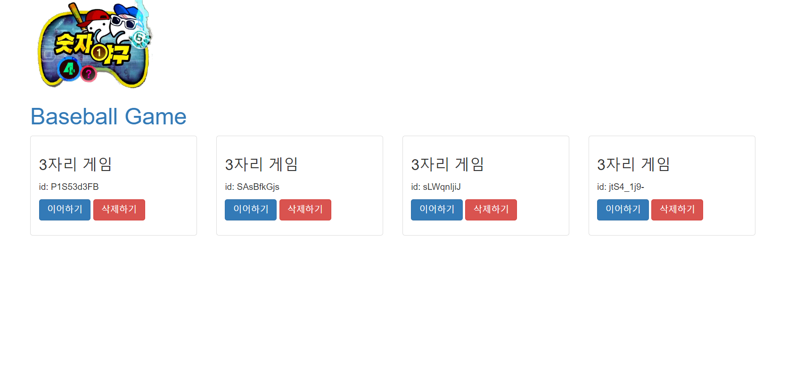
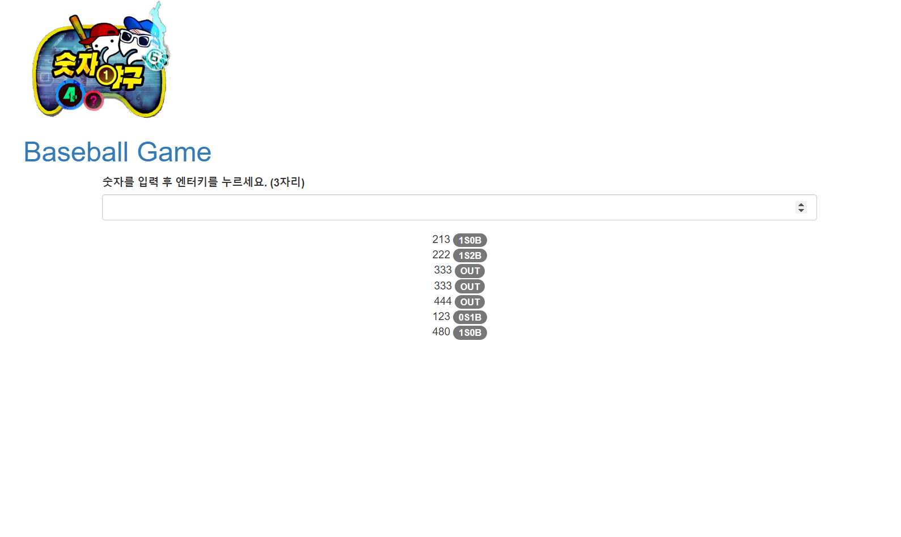

[Home](..)

# 프로젝트
JavaScript 200제 연습 프로젝트

## 개요
- 기간 : 2024. 03. 06 ~ 2024. 04. 15 (1개월)
- 기술 스택 : HTML, CSS, JavaScript, Node.js, express
- 목적 : JS 기초 공부 및 웹 프론트 체험
<!-- - 요약 :  -->
- 책 : [초보자를 위한 JavaScript 200제(고재도, 노지연 지음)](https://www.yes24.com/Product/Goods/70746749) 
<!-- - 링크 :  -->
- 결과 : [숫자 야구 게임 실습](./business/baseball/)
 

### 내용
    javascript 기본 사용법 및 문법, HTML 문서의 DOM을 활용한 응용 및 웹 서비스 기초

#### JS
    Promise, fetch, express, multer, cors, async/wait, localStorage, JSON, Express

#### HTML
    div, table, ul, ol, header, section, script, link

#### CSS
    text-align: center;

#### 오류 해결
    function 사용 오류 :{} 없이 사용해야만 다음 줄 바로 return 가능
    fs 오류 : fs openSync에서 권한 문제(EPERM: operation not permitted) 계속 파일 확인하고, 삭제하고 생성하고를 반복하다보니 발생한 오류 였음... 굳이 파일 읽기 권한 확인 없이 바로 쓰기(writeFileSync) 로 수정

### 환경세팅
- JavaScript (3.12.1 이상)
- yarn
- node (20.10.0)
- npm (10.2.3)
- vscode (+확장 프로그램 추가 => Live Server, Code Runner, Markdown All in one)
- chrome
- nodemon : node 파일 변경 시 자동 재시작(npx nodemon app.js)

### 추가 참고 내용(위 내용 외에 추가로 참고할만한 내용)
- cors
- Node.js 프로세스 관리자
- https://fontawesome.com/
- https://www.bootstrapcdn.com/